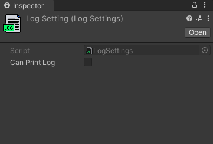

# logger-unity-package


## ABOUT
How to disable/Enable All of you log by one click?
The Centralized Enable/Disable Log Plugin is a powerful and versatile tool designed to streamline and optimize the logging process in software applications. This plugin serves as a centralized control hub for managing log output, allowing developers to enable or disable various log levels and categories at runtime without the need for recompilation.

## INSTALLATION

- *(via Package Manager)* add the following url into package manager
  - `https://github.com/vikaspatel-unity/logger-unity-package.git`


## HOW TO

- Open **Assets - Logger - Log Settings** 
- enable or disbale log via log settings



## ExampleCode

```csharp
 void Start()
    {
        Logger.Log("TagName", "This is log message");

        Logger.LogError("TagName", "This is log error message");

        Logger.LogAssertion("TagName", "This is log logAssertion");

        Logger.LogWarning("TagName", "This is log log warning");
    }
```

## Limitation
- it does not disable/enable logs that was printed using Debu.Log() methods.
- Logger Class only supports Logger.Log ,Logger.LogError,Logger.LogAssertion,Logger.LogWarning